# Portfolio Website Knowledge Graph

## 1. Project Abstract
Personal portfolio website for **Anshay Agarwal** — an AI R&D Engineer, Founder, and IIT Delhi/Mandi alumnus with 10+ years of experience spanning DRDO, Nvidia, GreyscaleAI, Qualcomm, and multiple founded ventures. The website overhaul aims to transform a plain Bootstrap 4.4.1 single-page site into a world-class, **highly creative Isekai / Fantasy RPG-themed** animated portfolio. It will position Anshay as a "Grand Magus / Level 99 Architect," wrapping his real-world achievements (AI, Neuroscience, Engineering) in an unforgettable, game-like immersive UI.

## 2. Architecture Graph

```mermaid
graph TD
    subgraph "Isekai Fantasy RPG Portfolio"
        VITE[Vite 8 Dev Server] --> REACT[React 19]
        REACT --> FM[Framer Motion 12]
        REACT --> HERO[Hero: The Summoning]
        REACT --> ABOUT[About: Character Lore]
        REACT --> QUESTS[Projects: Epic Quests]
        REACT --> LOG[Experience: Adventurer's Log]
        REACT --> GRIMOIRE[Skills: Magic Grimoire]
        REACT --> ACADEMIES[Education: Arcane Academies]
        REACT --> BARDS[Testimonials: Bards' Tales]
        REACT --> TAVERN[Contact: Join the Party]
        REACT --> PARTICLES[MagicParticles Canvas]
        REACT --> SHARED[RPGPanel / SectionHeader / ScrollReveal]
    end

    subgraph "Data Layer"
        PROFILE[profile.js] --> ABOUT
        PROJECTS[projects.js] --> QUESTS
        EXPERIENCE[experience.js] --> LOG
        SKILLS[skills.js] --> GRIMOIRE
        EDUCATION[education.js] --> ACADEMIES
        TESTIMONIALS[testimonials.js] --> BARDS
    end
```



## 3. Profile Data

### Identity
- **Name**: Anshay Agarwal
- **Title**: AI R&D Engineer | Founder
- **Tagline (Resume)**: "Founding AI Engineer"
- **Tagline (Current Site)**: "The Expert Generalist"
- **Email**: anshayagr@gmail.com
- **Phone**: +91-8800472674
- **LinkedIn**: https://www.linkedin.com/in/anshayagarwal
- **GitHub**: https://github.com/anshay
- **LeetCode**: ⚠️ REMOVE 
- **Location**: India (based on phone number)
- **MBTI**: INTJ-T (The Architect)
- **Photo**: ⚠️ REMOVE (Using Avatar/Lore approach)

### Summary (from resume)
> 10+ years of experience specializing in zero-to-one product builds, rapid prototyping, and architecting autonomous agentic workflows (LangGraph/LLMs). Passionate about taking complex problems and building end-to-end AI products.

### Stack (from resume)
> Chat & Voice AI Agents, RAG Pipelines, WebSockets (Real-time Audio)

## 4. Career Timeline (⚠️ CRITICAL AUDIT REQUIRED)

*Note: The timeline and content below currently contain inaccuracies (e.g. missing NDPL internship, wrong DRDO title/project, incorrect timings). Must be fully audited and fixed before UI implementation.*

| Period | Company | Role | Key Tech | Highlights |
|--------|---------|------|----------|------------|
| Oct 2025 - Jun 2026 | Stealth AI Venture | Lead AI Systems Architect | AI, Python | <500ms Voice-to-Action pipeline, fault-tolerant state machine, 99.9% uptime microservices |
| Jun 2025 - Sep 2025 | SchoolBook.AI | Co-Founder & Lead AI Architect | AI, Python | Multimodal RAG Pipeline, LangGraph autonomous agents, full-stack GenAI deployment |
| Apr 2023 - Mar 2025 | Qualcomm | Senior Lead Software Engineer | AI, Python, C++ | 96% GPU latency reduction (35ms→1.3ms), HDR flows for Premium Tier Snapdragon |
| Sep 2022 - Apr 2023 | Calpion | Lead Software Engineer | C++, Python | CT scan artery segmentation, protein mutation CNN models, 30-50% AWS pipeline speedup |
| Feb 2021 - Sep 2022 | GreyscaleAI | Software Engineer | C++, Python, OpenCV | Multi-modal X-Ray+RGB inspection (Nestle), led team of 8, embedded UI, 50+ features/week |
| Nov 2021 - Jan 2022 | Canairy (High Alpha) | Consultant | Python, OpenCV, ROS | Cattle segmentation FPN (0.96 IOU), LIDAR depth, ROS channels |
| Aug 2018 - Present | Xern AI | Founder | Flutter, Python, AI | BCI, Autodub, Play Store apps, multiple AI ventures |
| Aug 2017 - Jul 2018 | Nvidia | System Software Engineer | C++, Python | Tegra Camera imaging stack, lens shading, Bayer demosaicing |
| Aug 2013 - Jul 2015 | DRDO | Scientist | C++, MATLAB, OpenCV | Night vision thermal cameras (40km range), lens shading correction, Raspberry Pi controller |
| May 2011 - Jul 2011 | NDPL | Intern | - | Grid operations, SCADA |

## 5. Education (⚠️ CRITICAL AUDIT REQUIRED)

*Note: Stream, to/from dates, and thesis details are incorrect for both IIT Delhi and IIT Mandi.*

| Period | Institution | Degree | Notable |
|--------|-------------|--------|---------|
| 2015 - 2017 | **IIT Delhi** | M.Tech, Computer Technology | Dissertation: Thermal Video Stabilization; BCI project using EEG motor imagery |
| 2009 - 2013 | **IIT Mandi** | B.Tech, Electrical Engineering | Thesis: Automobile Collision Prevention; **Founded Robotics Section**; Built 1st robot of IIT Mandi |

### Specializations
- **Wharton School**: Entrepreneurship (2021-2022)
- **University of Toronto**: Self Driving Cars (2022)
- **Northwestern University**: Modern Robotics (2020-2022)
- **DeepLearning.AI**: TensorFlow Professional Cert (2019-2020)
- **DeepLearning.AI**: Deep Learning Specialization (2018-2019)

## 6. Achievements (⚠️ CRITICAL AUDIT REQUIRED)
*Note: GRE is incorrect, GATE is missing, JEE percentile is missing and title is wrong.*

- **GATE**: AIR 423 (99.9% / 99.998 percentile in ECE)
- **IIT JEE**: Rank 3547 (Top 1%, ~0.4M students)
- **GRE**: 321/340 (170/170 Quantitative — perfect score)
- **XII Board (AISSCE)**: Top 0.1% — Mathematics 100%, Computer 99%
- Merit Cum Means Scholarship recipient
- Founded Robotics Section at IIT Mandi

## 7. Projects (Comprehensive)
*(These will be themed as "Epic Quests" or "Crafted Artifacts" in the new Fantasy RPG UI.)*

### 🔬 Research & Deep Tech

#### Vitalis (MedGemma Impact Challenge)
- **Type**: AI Health Screening App (Stealth-Mode Health-Tech)
- **Stack**: Flutter (Clean Architecture + Riverpod + GoRouter), FastAPI
- **AI Models**: HeAR (Health Acoustic Representations), MedSigLIP, Gemini
- **Features**: 8 vital signs — Neuro-Tremor (Parkinson's), Neuro-Chat, Anemia-Eye, Jaundice-Cam, Oral-Cancer, Cough-Check (TB), Cardio-Vision (rPPG), Alzheimer-Voice
- **Portfolio Angle**: Founder experience, medical AI, Kaggle competition
- **Repo**: /run/media/xarc/Git/Github/vitalis

#### EEG-to-Image Reconstruction
- **Type**: Neuroscience/AI Research
- **Stack**: Python, CLIP, Kandinsky 2.1, 768-dim encoders
- **Details**: Brain signal to image generation, training overfit models, streaming EEG end-to-end
- **Repo**: /run/media/xarc/Git/Github/image_eeg

#### Cognitive OS Agent (EEG)
- **Type**: Brain-Computer Interface
- **Stack**: Python, EEG processing, MOABB
- **Details**: EEG-based cognitive operating system agent
- **Repo**: /run/media/xarc/Git/Github/cognitive_os_agent

#### Venom-to-Drug Discovery
- **Type**: Computational Drug Discovery
- **Stack**: Python, RFDiffusion, ProteinMPNN
- **Details**: Pipeline converting venom compounds to therapeutic drugs. Phases: analysis → backbone generation → protein sequence design. Ran 1000-design pipelines.
- **Repo**: /run/media/xarc/Git/Github/venom_to_drug

### 🤖 AI Agents & Voice

#### Agent on Call
- **Type**: Telegram AI Voice Agent
- **Stack**: Python, Gemini 1.5 Flash, faster-whisper, edge-tts, openwakeword, FFMPEG
- **Features**: Auto-join calls, real-time transcription, wake word detection, meeting summaries, <500ms latency voice pipeline, WebSocket audio streaming
- **Architecture**: Modular OOP, containerized microservices, 99.9% uptime
- **Repo**: /run/media/xarc/Git/Github/Agent_on_call

#### SchoolBook.AI
- **Type**: Educational AI Platform (Co-Founded)
- **Stack**: Python, LangGraph, Gemini Pro, Vector DBs, LangChain
- **Details**: Multimodal RAG for NCERT textbooks, autonomous agentic workflows, full-stack GenAI
- **Repo**: /run/media/xarc/Git/Github/schoolbook

### 📱 Live Products (Play Store)

#### Praan - Spiritual Literature Platform
- **Type**: Full-featured spiritual app (MASSIVE project)
- **Stack**: Flutter, Riverpod, GoRouter, Supabase (PostgreSQL + Auth), SQLite, Hive
- **Features**: Netflix-style scripture library, AI Guru chatbot, Kundli/astrology, Panchang, Japa Mala, Meditation Timer, Live Pooja, Horoscope, Festival Calendar, Wallpapers, Streak system, Subscription/diya monetization, In-app YouTube player, AI kundli, Numerology, Voice-guided Pooja
- **Scale**: 40+ festivals, 120+ horoscope predictions, 30+ tithis, vedic astronomy engine
- **Marketing**: Instagram reels, YouTube videos, content creation
- **Repo**: /run/media/xarc/Git/Github/praan

#### PipeMaster (Plumbing Code Exam Prep)
- **Type**: Niche exam prep app
- **Stack**: Flutter, RevenueCat, subscriptions
- **Monetization**: Monthly $14.99, Quarterly $39.99, Lifetime $119.99
- **Features**: Exam prep, tools, cheat sheets, video content
- **Website**: https://xernai.lovable.app/app/pipemaster
- **Repo**: /run/media/xarc/Git/Github/niche_apps/plumber_code

#### BCBR (Basic Course in Biomedical Research)
- **Type**: Medical exam prep app
- **Stack**: Flutter
- **Features**: 50 topics, notes with LaTeX, infographics, video links
- **Marketing**: Instagram reels, LinkedIn
- **Repo**: /run/media/xarc/Git/Github/bcbr

### 🛠️ Other Notable Projects

#### Calox - AI Personal Analytics
- **Stack**: Flutter, Hive, Gemini
- **Features**: Offline-first AI platform, autonomous analyst for unstructured logs, trend visualization
- **Repo**: /run/media/xarc/Git/Github/calox

#### CookNook
- **Type**: Meal planning app with Tinder-swipe UI
- **Repo**: /run/media/xarc/Git/Github/cooknook

#### AI-Integrated Life OS (Obsidian)
- **Type**: Personal knowledge management system
- **Features**: AI integrations, custom CSS, plugin setups, GitHub sync, daily notes system
- **Details**: 8+ months of daily structured notes, automated workflows

#### AIPod / PodcastGPT - YouTube Video Summarizer
- **Stack**: React Native, Expo, LangChain, Vector DB
- **Features**: Podcast/video summarization, semantic search

#### Novel: "The Compromise"
- **Type**: Creative writing — completed first version Dec 2025

#### Google Agentic AI Course / LangGraph Academy
- Completed coursework on agentic AI

### 📋 Historical Projects (from current site)
- **Eevolve**: 2048 Android game with Eevee theme (Flutter)
- **Autodub**: Automatic video dubbing with lip sync
- **BCI at IIT Delhi**: EEG motor imagery cursor control

## 8. Skills (⚠️ PURGE FAKE ITEMS)
*Note: Currently contains fluffed/fake items. Must be audited to only include strict, accurate technical arsenal.*

### Languages
Python, C++, JavaScript, Dart

### AI/ML
- **Agents**: LangGraph, LangChain, Autonomous Workflows
- **LLMs**: Gemini (Pro, Flash, 2.5), RAG Pipelines
- **Deep Learning**: FastAI, TensorFlow, PyTorch
- **Computer Vision**: OpenCV, MedSigLIP, Image Processing
- **Audio/Speech**: Whisper ASR, HeAR, VAD, Real-time Audio
- **Neuroscience**: EEG Processing, BCI, Motor Imagery, CLIP Embeddings
- **Drug Discovery**: RFDiffusion, ProteinMPNN

### Mobile/Frontend
- Flutter (Riverpod, GoRouter, Clean Architecture)
- React Native / Expo
- React, Vite (web)

### Backend/Infrastructure
- FastAPI, Supabase, Firebase
- WebSockets, MQTT, Embedded Systems
- Docker, Containerized Microservices
- PostgreSQL, SQLite, Hive (NoSQL), Vector DBs

### Systems
- Git, Linux, ROS, CMake, Arduino
- GPU Programming (OpenGL, CUDA)
- Blender, Unity, MATLAB, Qt, KiCAD

## 9. Design Decisions (v2: Fantasy RPG / Isekai — IMPLEMENTED)

### Decision 1: Tech Stack
- **React 19 + Vite 8 + Framer Motion 12**: Core stack.
- **CSS Modules**: Per-component styling with global RPG design tokens.
- **No external CSS framework**: Pure custom CSS for maximum fantasy UI control.

### Decision 2: Design System
- **Palette**: Enchanted dark (gold #c9a84c, parchment #e8dcc4, mana-cyan #00d4ff, health-red #e74c3c, rune-violet #8b5cf6).
- **Typography**: Cinzel Decorative (display), Cinzel (headings), MedievalSharp (accents), Inter (body), JetBrains Mono (code/stats).
- **Components**: RPGPanel (ornate gold borders), stat-bars (HP/MP style), rarity badges (legendary/epic/rare/common), RPG buttons.

### Decision 3: Thematic Mapping (IMPLEMENTED)
- **Hero** → "The Summoning" (rotating rune circle portal, gold gradient name)
- **About** → "Character Lore" (RPG stat bars INT/WIS/DEX/STR/CHA/CON)
- **Projects** → "Epic Quests" (rarity-colored quest cards with filters)
- **Experience** → "The Adventurer's Log" (vertical timeline, type-colored nodes)
- **Skills** → "Magic Grimoire" (spell schools with glow-on-hover tags)
- **Education** → "Arcane Academies & Trials" (academy crests, trial items)
- **Testimonials** → "Bards' Tales" (NPC dialogue boxes)
- **Contact** → "Join the Party" (tavern notice board, 'Send a Raven')

## 10. Current State
- **Phase**: Implementation Complete (Phase 4)
- **Status**: All 8 sections implemented with Fantasy RPG theme.
- **Branch**: `fantasy_build` (12 commits)
- **Build**: Clean (287ms, 0 ESLint errors)
- **Next**: Visual QA in browser, then merge to main.

## 11. LinkedIn Testimonials (⚠️ MISSING TESTIMONIALS TO BE RESTORED)
*(The following were included, but more exist behind auth wall that need to be restored to the codebase.)*

### Hansa Kary (GreyscaleAI colleague)
> "It is a pleasure working with Anshay! He's friendly, adaptable, talented, hardworking, and reliable. As a consummate full stack developer, Anshay is great at planning, collaborating, and developing solutions. I feel lucky to have worked with him, and I wish him great success."

### Daniel Cannistraci (GreyscaleAI colleague)
> "Anshay was amazing to work with. A true team player and ready to help whenever needed. I worked directly with him in bridging the gap between hardware and software. Primary focus was designing the microcontroller interface. He was always available for testing and worked diligently with the hardware team to insure that the software was properly communicating. We worked tirelessly for several months on this project and I'm proud of what was accomplished. Would love to work with Anshay again and I highly recommend him."

## 12. Certifications (from LinkedIn)

| Certificate | Issuer | Credential |
|-------------|--------|------------|
| Google Gen AI Intensive Course | Google | — |
| Introduction to Self-Driving Cars | Coursera (U of Toronto) | ZY82R5BB8BM5 |
| Entrepreneurship Specialization | The Wharton School | 9TYT6SL4Q6L3 |
| Robot Motion Planning and Control | Coursera (Northwestern) | RN54ETE4E7PP |
| TensorFlow in Practice Specialization | Coursera (DeepLearning.AI) | YSJBPBYKH8ZD |
| Deep Learning Specialization | Coursera (DeepLearning.AI) | 3Z3VEG5TTVQN |
| Synapses, Neurons and Brains | Coursera (Hebrew University) | C3SHTSX5WLJA |
| Introduction to Neurohacking In R | Coursera (Johns Hopkins) | TD5UWPN4BM93 |
| The Brain and Space | Coursera (Duke University) | F8E82HQG656F |
| Fundamental Neuroscience for Neuroimaging | Coursera (Johns Hopkins) | 47JS8JZK522H |

## 13. Legacy Projects (from current projects page at anshay.github.io/projects)

### BCI
- Motor Imagery EEG classification at IIT Delhi
- Signal processing with EEGLAB/BCILAB in MATLAB

### Deep Learning
- Reinforcement Learning (OpenAI gym)
- GAN (MNIST/Fashion MNIST)
- Music Generation (LSTM - abc and wav)
- Pneumonia detection from chest X-ray
- Trigger Word Detection
- Neural Machine Translation (attention model)
- Face Detection with CNN (triplet loss)
- Neural Style Transfer
- Car Detection with YOLOv2
- IMDB review sentiment, BBC text classification, tweets sentiment
- Poetry generator (Shakespeare style)
- Chatterbox (DNN chatbot)

### Systems/Hardware
- Automatic Collision Prevention System (B.Tech thesis)
- Thermal Video Stabilization (M.Tech dissertation)
- Biometric door locking system
- Alcohol detector ignition control (TI MCU Design Contest 2012)
- Sound Localization experiment
- Isolated Digit Recognition using HMMs
- Quadrature Amplitude Multiplexer (TI Analog Design Kit)

### Software
- Telegram Muxxer (channel aggregator bot)
- Open3D API (connected component grouping)

## 14. GitHub Public Repos
- `2048` (forked, Jupyter Notebook)
- `deeplearning` (Jupyter Notebook)
- `Eeveelution-2048` (2048 with Pokemon Eevee, C#)
- `Unity` (Unity Projects, C#)
- `BCI` (Brain Computer Interface projects)
- `anshay.github.io` (this portfolio, HTML)
- Total: 21 repos (mostly private)

## 15. LinkedIn Activity (Recent Posts - June 2026)
- Post about BCBR medical course built with AI/NotebookLM
- Post about Vitalis "Neuro-Chat" - AI medical triage replacing WebMD
- Post about building 44 video lectures from ICMR syllabus
- Article: "AI Guru - Multi-modal AI Agent for Google-Kaggle Gen-AI Capstone Project"
- Active thought leadership on #HealthcareAI #BuildInPublic

## 16. User Feedback Log

| Iteration | Feedback / Decisions |
|-----------|----------------------|
| **v1** | Keep photo, remove phone number, use tinyurl for apps, include novel, no Google Analytics, remove robotics/self-driving certs. |
| **v2** | UI is uncreative/childish. **Pivot to Isekai/Fantasy RPG theme.** Remove photo. Remove LeetCode. Massive data inaccuracies reported across education, experience, achievements, and skills. Implementation halted to fix data first. |

## 17. File Structure (Current — Fantasy RPG Build)
```
anshay.github.io/
├── index.html               (Vite entry, Cinzel/MedievalSharp fonts, SEO meta)
├── vite.config.js           (Vite 8 config, framer-motion code-split)
├── package.json             (React 19, Framer Motion 12, lucide-react)
├── src/
│   ├── main.jsx             (React root)
│   ├── App.jsx              (Section composition, gold progress bar)
│   ├── index.css            (RPG design system: tokens, panels, stat-bars, rarity)
│   ├── data/
│   │   ├── profile.js       (RPG stats, lore, contact)
│   │   ├── education.js     (IIT Delhi/Mandi, achievements, certs)
│   │   ├── experience.js    (10 entries, corrected timeline)
│   │   ├── projects.js      (18 projects with rarity system)
│   │   ├── skills.js        (6 clusters, audited)
│   │   └── testimonials.js  (4 LinkedIn recommendations)
│   └── components/
│       ├── ParticleBackground/  (Canvas magic particles)
│       ├── Navbar/              (RPG nav: Lore/Quests/Log/Grimoire/etc)
│       ├── Hero/                (The Summoning - rune circle portal)
│       ├── About/               (Character Lore - stat bars)
│       ├── Quests/              (Epic Quests - rarity cards)
│       ├── AdventurersLog/      (Experience timeline)
│       ├── Grimoire/            (Skills - spell schools)
│       ├── Academies/           (Education - guild banners)
│       ├── BardsTales/          (Testimonials - NPC dialogue)
│       ├── Tavern/              (Contact - notice board)
│       └── common/              (RPGPanel, SectionHeader, ScrollReveal)
├── public/
│   ├── assets/download/     (Resume, CV PDFs)
│   ├── images/              (pic.jpg - unused, kept for reference)
│   ├── favicon.svg
│   └── icons.svg
├── docs/
│   ├── knowledge_graph.md
│   ├── implementation_plan.md
│   └── prd.md
└── dist/                    (Build output: ~413KB, 287ms)
```
